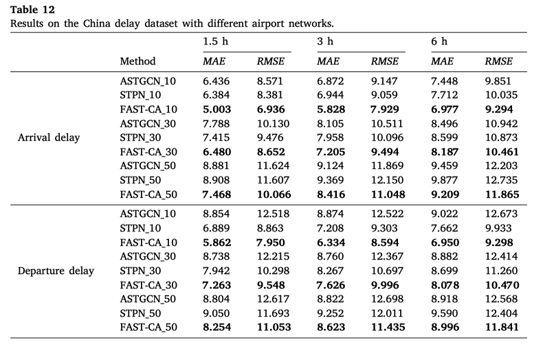

# 整理

## Imputation

1. 数据缺失普遍存在（传感器故障、数据传输错误），特殊场景下数据难获得
2. 数据的完整性可以提高model预测性能
   1. 之前的ablation study里面，不同的network上性能的差异（astgcn在不同的network上，loss几乎不变）
   
   2. 从data-efficient的角度来重新衡量model的性能（ode net的计算效率很低，是否可以从小图扩展到大图）
3. imputation的方式可以同时在时空领域上做扩展
    

    - 时间和时空数据的缺失，可以用RNN、GRU来处理
    - 参考GRAM-ODE的message passing机制，在空间的imputation上，可以通过局部network（data缺失比较少）的信息扩展到missing point上
    - 从空间角度考虑：diffusion model <https://arxiv.org/pdf/2309.01988>
    
4. generative network

## Anomaly Detection

1.
